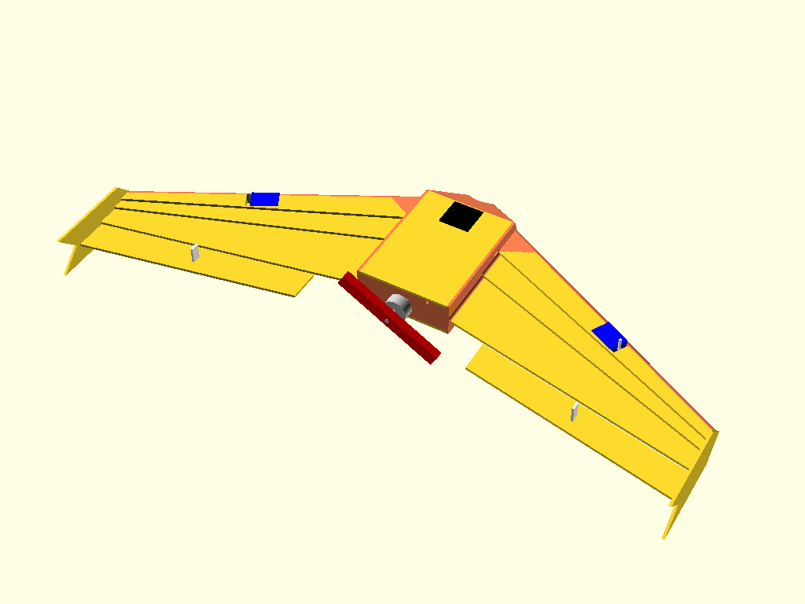
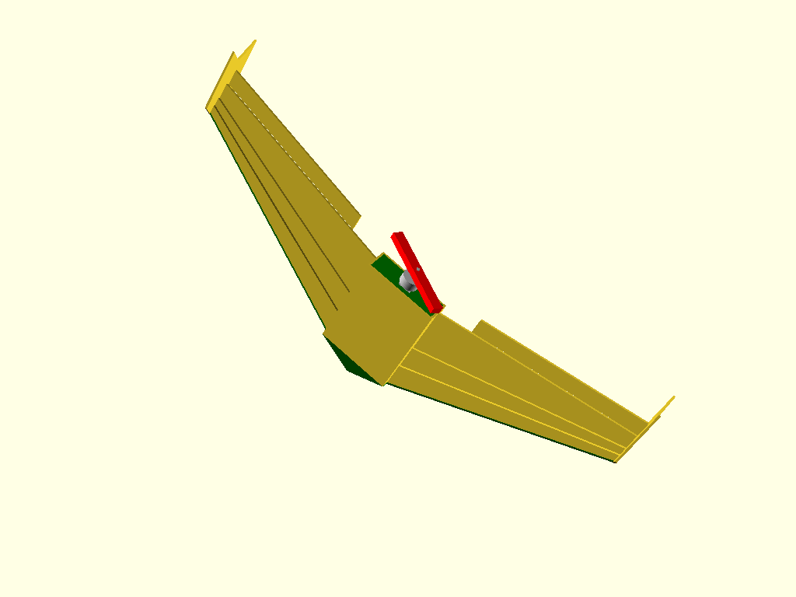
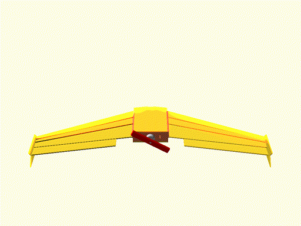
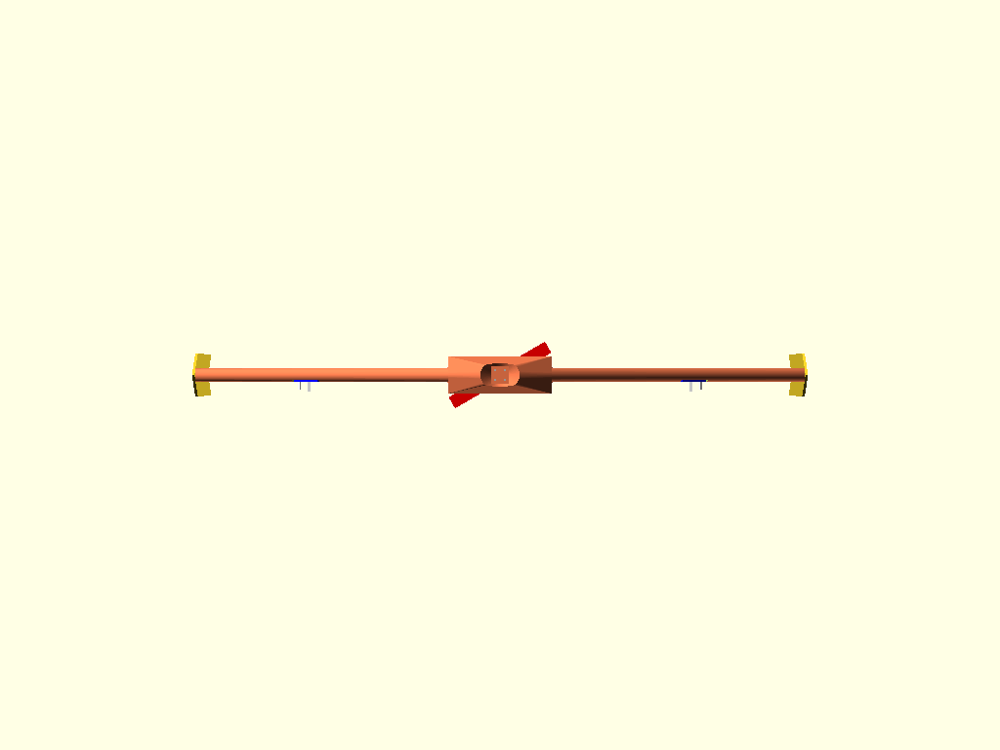
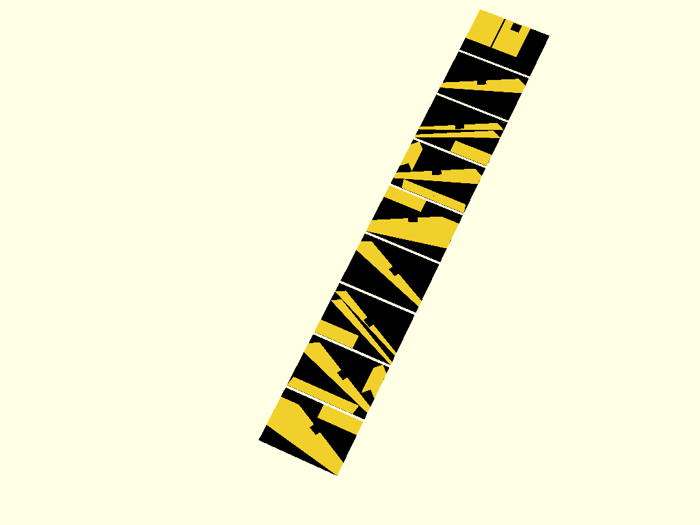
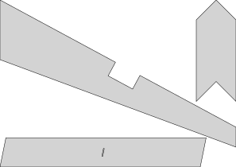
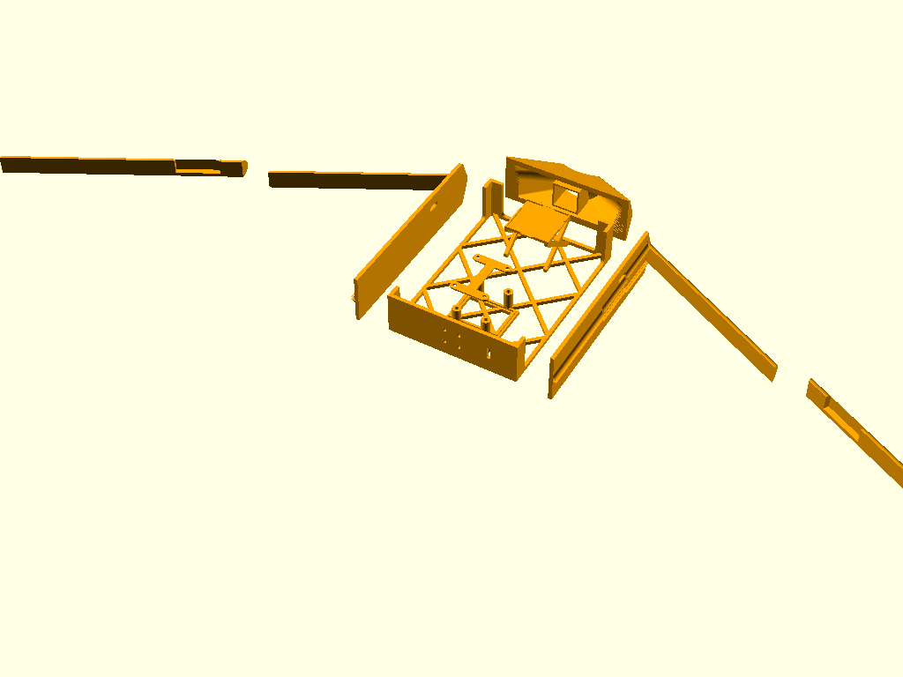
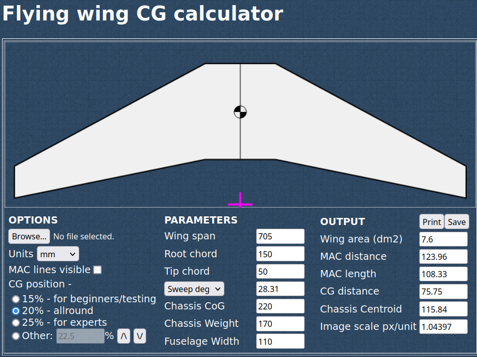
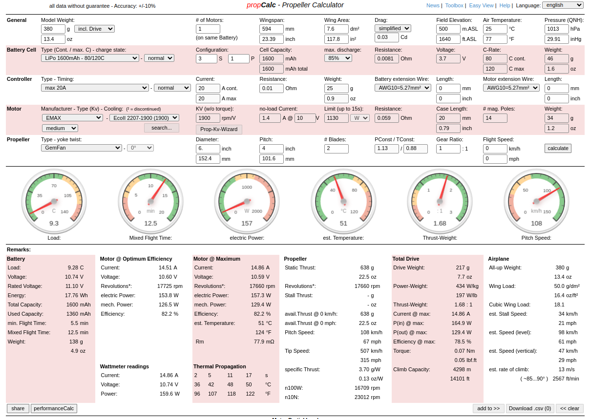
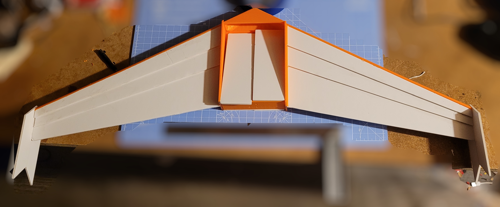

# FPV_Wing_KFm-6

Simple FPV wing model based upon simply cut foam sheets and simple 3d parts

## Basic Materials

The naked model is less than £9. Wingspan 594mm (or 705mm including body).

Aim to have construction to be as simple as possible. So based all dimensions upon A4, 3mm deep foam board. Combined with some 3d printed parts.

Key: Yellow: foam board, Green: Printed parts









[Center of Gravity at ~76mm back](http://rcwingcog.a0001.net/?i=1)


## FPV

Total cost, including motors, flight controller, analogue camera, battery, GPS is  £121.63 I was aiming for less than  £100.


## What Makes it Simple

The cuts use the most of the natural dimension of A4 sheets. 



Only eight sheets are needed. The model can export directly the SVG file, per page, for printing a template.



The 3d parts can be printed on a standard 200x200 print bed, with only one part requiring supports. The seven individual parts in the [stl directory](https://github.com/bmsleight/FPV_Wing_KFm-6/tree/main/stl)




## Model 

From within OpenSCAD.

Amend display variable to 1 - display model, 2 - print all the printed parts as a print bead, 3 - All the foam parts, 4 - All foam parts as SVGs, 5 - One page SVG file. 

```
display = 1;

module display(display=display)
{
    if(display==1)
    {
        display_model(foam=true, printed_part=true);
    }
    if(display==2)
    {
        print_all();
    }
    if(display==3)
    {
        print_foam_all(outline=true);
    }
    if(display==4)
    {
        projection() print_foam_all(outline=false);
    }
    if(display==5)
    {
        projection() print_foam(page=2, outline=false);
    }
}

display();
```

## Will it Fly ?






## Parts 

* Printed parts single shell, 15% infill
* Foam board 3mm A4
* Total for naked wing, including glue: 162 grammes 
* ESC 40g  https://www.unmannedtechshop.co.uk/product/dys-20a-2-4s-brushless-esc-with-5v-2a-bec-for-rc-fixed-wing-aircraft/
* Motor 32g https://www.unmannedtechshop.co.uk/product/emax-eco-ii-series-2207-motor/
* Battery 70g, 4S 650mah
 Props https://www.unmannedtechshop.co.uk/product/hqprop-t5-1x2-5x3-grey-propeller-2cw2ccw/
* camera VTX  https://www.aliexpress.com/item/1005008234258917.html?spm=a2g0o.cart.0.0.5ac538dalBiVNT&mp=1 and generic Camera 
* Flight controller (5.6g) https://www.hobbyrc.co.uk/speedybee-f405-wing-mini-flight-controller
* https://www.unmannedtechshop.co.uk/product/tbs-m10-gps-glonass-module/
* servos
* Servo horns https://www.amazon.co.uk/gp/product/B08MDXD3C1/

## Photos


